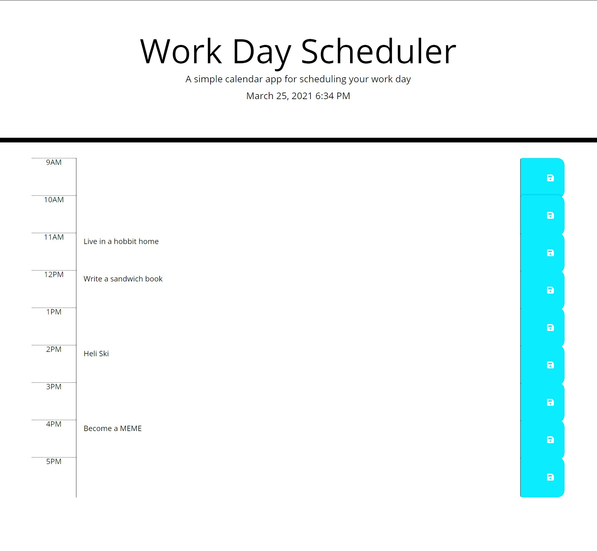

# Work-Day-Scheduler

[![LinkedIn][linkedin-shield]][linkedin-url]

https://unduhduhsea.github.io/Work-Day-Scheduler/

## About The Project

This project is a calendar app that allows you to save your tasks in the text area provided for each hour of a workday. The color formatting will change based off of what time of day it is (Grey for past, red for the current hour, and green for future hours). All of the date you save in the text area boxes is saved in local storage, which allows you to close out the calendar and open it back up with all of your tasks still populating the hour boxes.

### Built With

    -HTML
    -CSS
    -JavaScript
    -jQuery
    -Bootstrap

## Contact

Tyler Abegg - [@SeaDuh](https://twitter.com/SeaDuh) - tafimba@gmail.com

<!-- MARKDOWN LINKS & IMAGES -->
[linkedin-shield]: https://img.shields.io/badge/-LinkedIn-black.svg?style=for-the-badge&logo=linkedin&colorB=555
[linkedin-url]: www.linkedin.com/in/tyler-abegg
[product-screenshot]: images/screenshot.png
